# AWS App Runner

Deploy containerized web applications and APIs at scale.

AWS App Runner is a fully managed container application service that allows build and run secure web applications at scale without prior container or infrastructure experience.

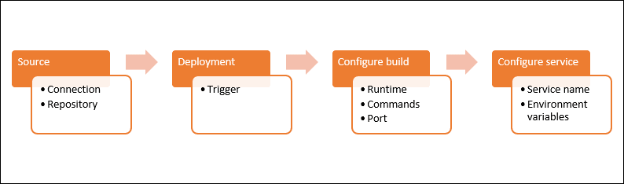

Step by step to create App Runner Service

## Go to App Runner Console

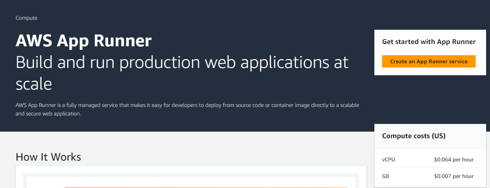

## Step 1: Source and Deployment
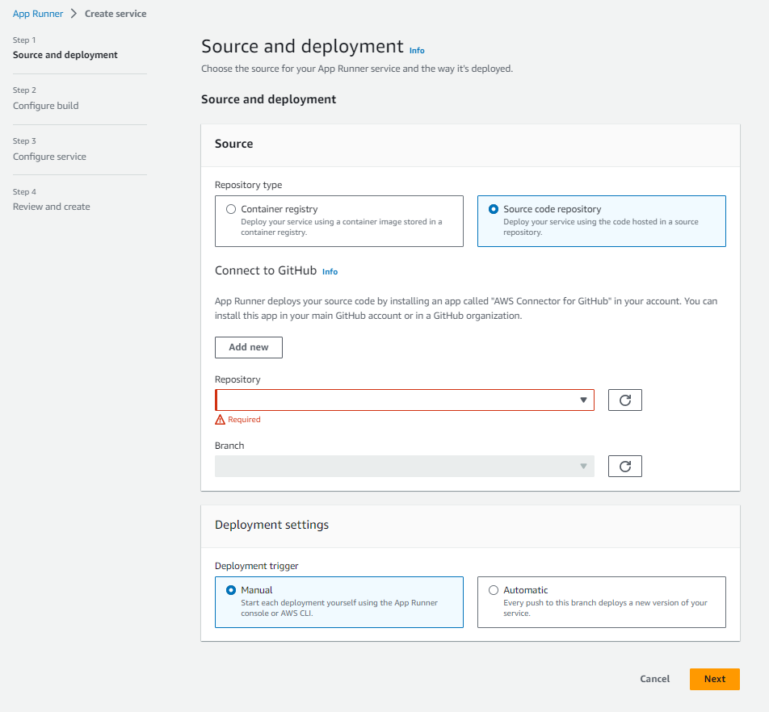

At the repository type, we can choose "Container registry" or "Source code repository". In this example, we will choose "Source code repository".

Click "Add new" button to create connection to Github

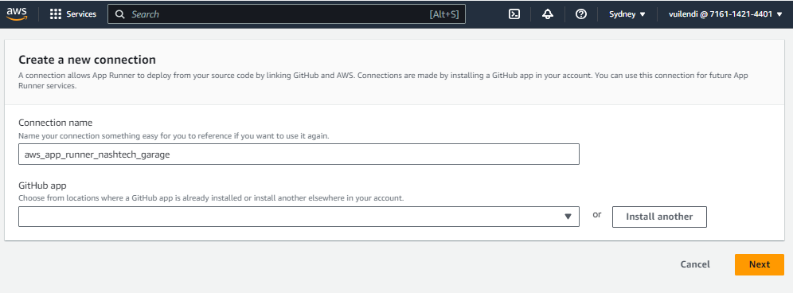

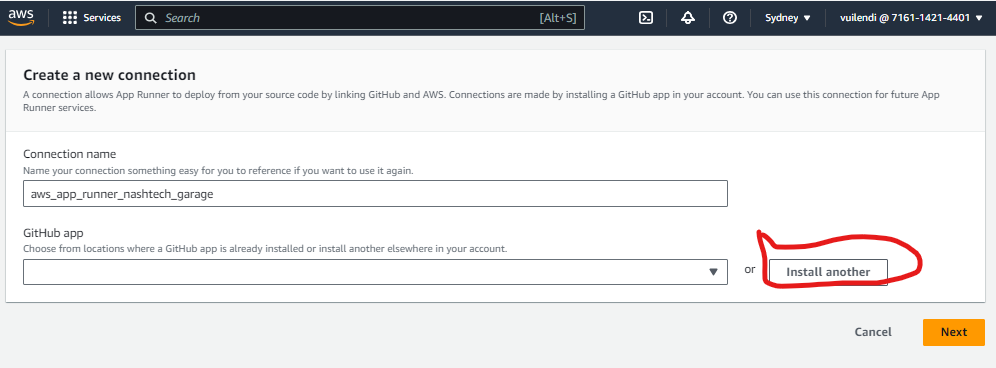

After click "Install Another" button, it will require permission to connect Github app

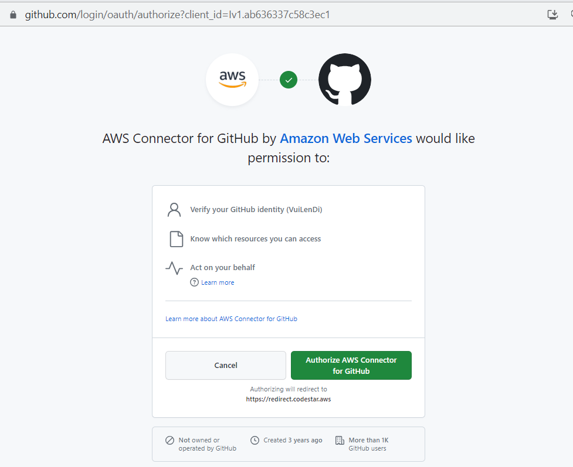

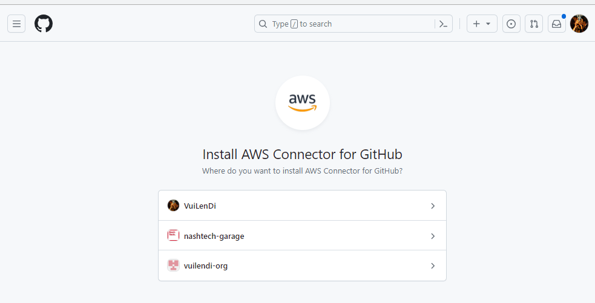

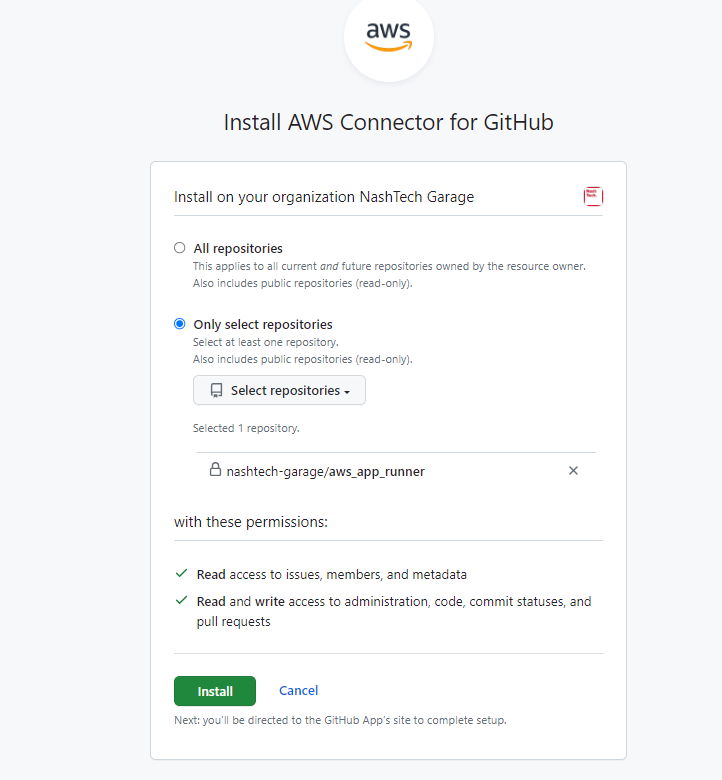

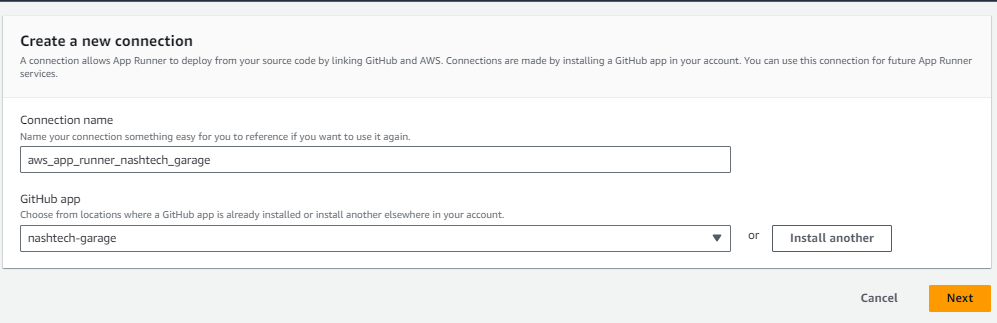

## Step 2: Configure build

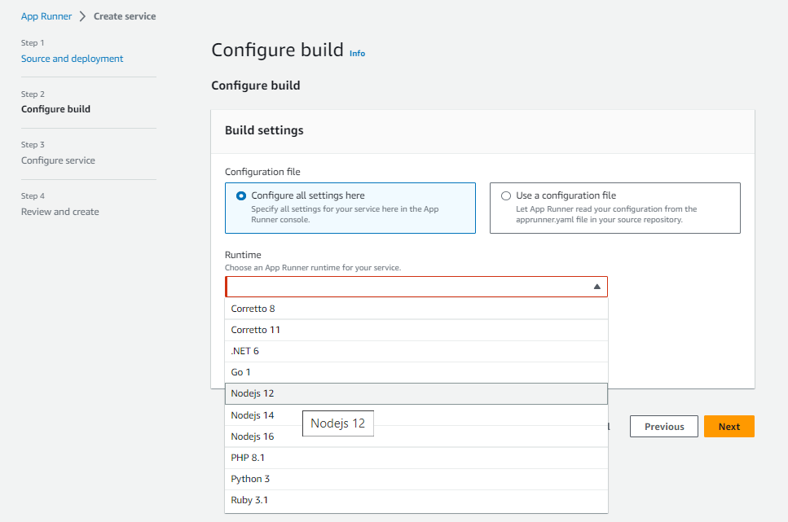

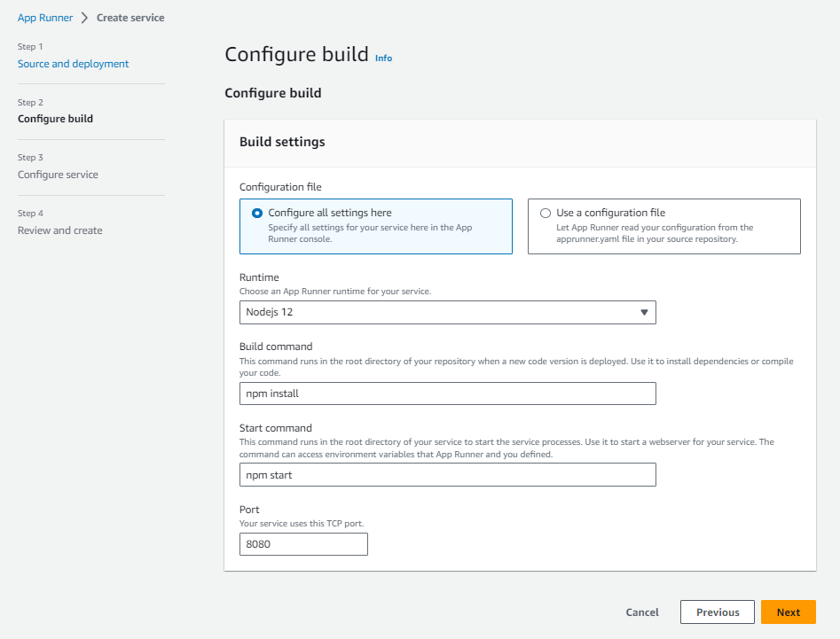

At step 2 we can configure manual or create "apprunner.yaml" at code folder

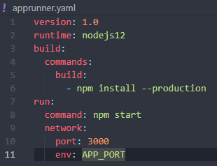

## Step 3: Configure service

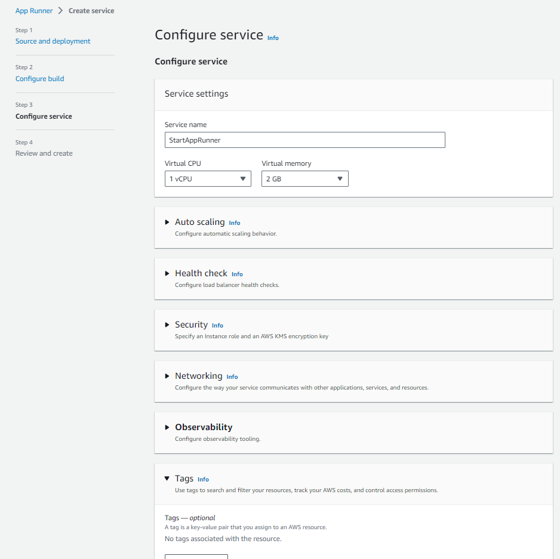

At this step, we can choose configuration for service.

## Step 4: Review and create

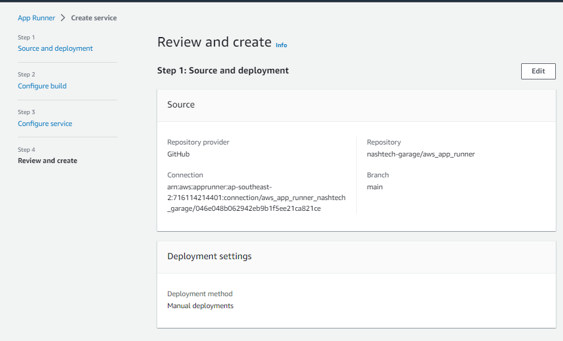

## Finally

After finish step 4, we can see the dashboard of StartAppRunner Service

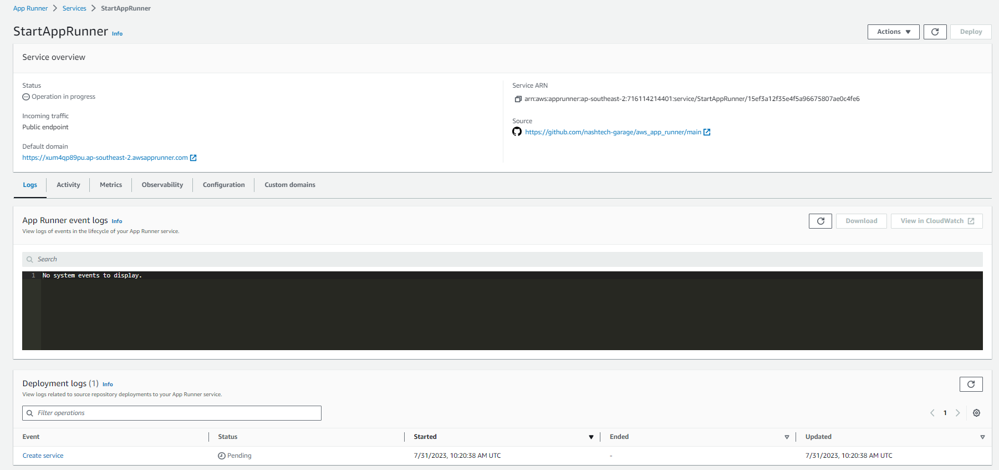

Wait some minutes (5min), we will see the result

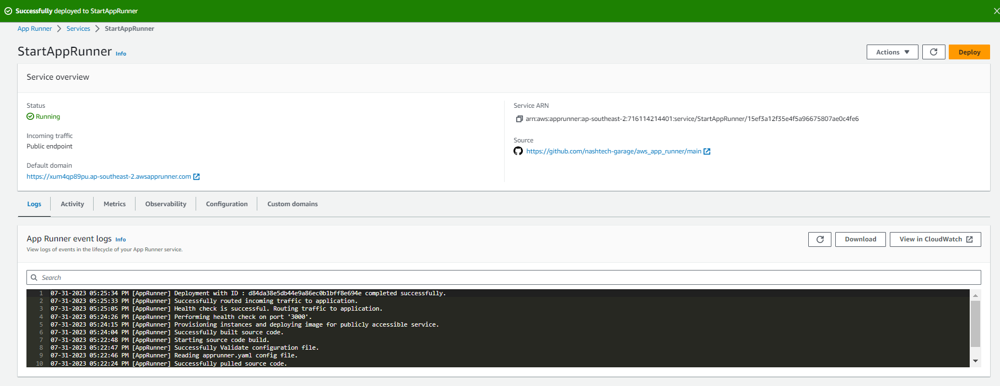

If our code have problem, service will automatic roll back.
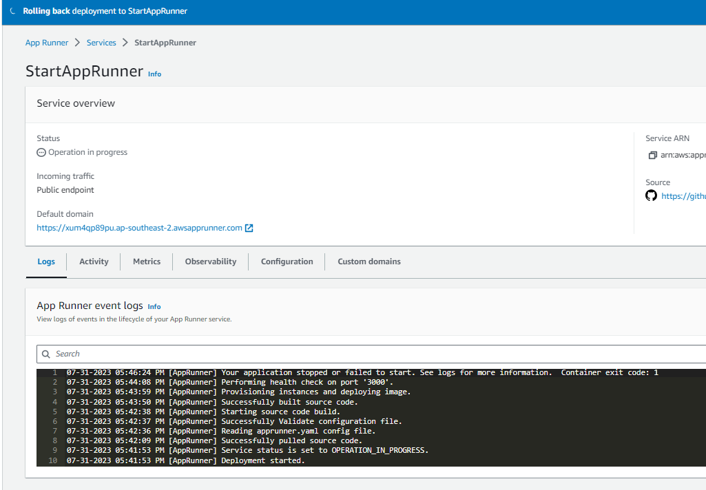

Because we choose manual, so if we want to deploy again, click "Deploy" button.
